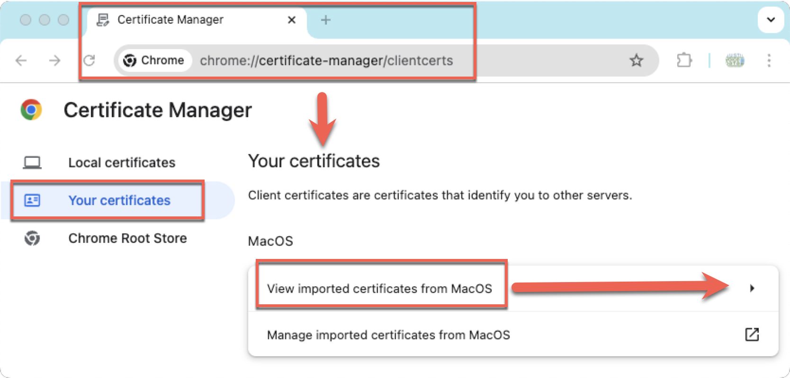
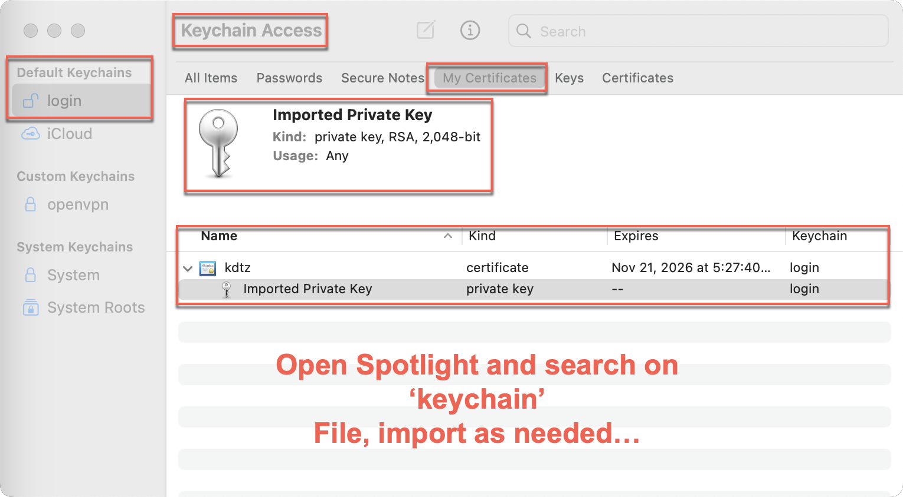

# Client Certificates

For alpha testing, we use the local CA authority on the TAKServer. Follow the instructions below to add client certificates.

## Adding Client Certificates

1. Open your Chrome browser.
2. Navigate to the certificate manager by clicking on the following link: [chrome://certificate-manager/clientcerts](chrome://certificate-manager/clientcerts).

Notice the certs are coming from the OS. 

## Keychain Access (MacOS)

On macOS, you can find the certificate manager by navigating to `Applications > Utilities > Keychain Access`. Alternatively, you can use the following link to open the certificate manager in Chrome: [chrome://settings/certificates](chrome://settings/certificates).

Use KeyChain Access app on Mac. Looks like Apple is replacing it with "Passwords".

## Navigate to TAK Server

https://DNSNAME:8443

Select the Client Certificate when prompted.
